<div align="center">

# 🚀 Product Analytics SQL
## 🛒 E-commerce × ☁️ SaaS

### Task 2 — Product Analytics SQL + SaaS Onboarding


**A decision-focused SQL portfolio showing how one analytical toolkit changes when the business moves from high-volume B2C behaviour to account-based B2B SaaS economics.**

[📊 Query Portfolio](#-query-portfolio) · [🧭 Data Model](#-data-model) · [🖼️ Visual Evidence](#-visual-evidence) · [📖 Case Study](#-portfolio-case-study) · [🛠️ Skills](#️-skills-demonstrated)

</div>

---

# ⚡ 30-Second Recruiter View

> **What I solved**  
> Turned 10 stakeholder questions into production-style PostgreSQL analyses across **E-commerce** and **SaaS**.
>
> **What this proves**  
> I can work beyond SQL syntax: define metrics, identify grain, choose the right denominator, handle messy data, validate outputs, interpret the result, and convert it into a concrete product/business action.
>
> **Why the project is interesting**  
> The word **retention** changes meaning across domains. In E-commerce it is primarily behavioural; in SaaS it is an economic question about recurring revenue, churn and expansion.

## 🎯 Portfolio Snapshot

| Dimension | Implementation |
|---|---|
| **Domains** | 🛒 B2C E-commerce + ☁️ B2B SaaS |
| **Databases** | PostgreSQL · `ecom` + `saas` schemas |
| **BI / Query Interface** | Metabase |
| **Business Analyses** | 10 · 5 E-commerce + 5 SaaS |
| **Analytical Grain** | Session · Customer · Account · Subscription · Event |
| **SQL Techniques** | CTEs · Window Functions · Conditional Aggregation · Cohorts · Funnels · Percentiles · Revenue Reconstruction |
| **Stakeholder Lens** | Product · Growth · Marketing · Finance · CRM · Operations · Customer Success |
| **Quality Discipline** | Explicit sanity checks, reconciliation logic and data-quality handling |
| **Portfolio Outputs** | SQL repo · schema dictionaries · interpretations · Metabase evidence · Notion case study |

---

# 🧠 The Analyst Mindset Behind the SQL

The project follows one repeatable workflow:

```text
┌────────────────────┐
│ 1. DEFINE          │  Business question + metric definition
└─────────┬──────────┘
          ↓
┌────────────────────┐
│ 2. MODEL           │  Grain + joins + observation window
└─────────┬──────────┘
          ↓
┌────────────────────┐
│ 3. COMPUTE         │  CTEs + windows + conditional logic
└─────────┬──────────┘
          ↓
┌────────────────────┐
│ 4. VALIDATE        │  Bounds + reconciliation + sanity check
└─────────┬──────────┘
          ↓
┌────────────────────┐
│ 5. DECIDE          │  Interpretation → PM action → next question

---

# 🆚 B2C vs B2B — The Core Comparison

| Analytical Lens | 🛒 E-commerce | ☁️ SaaS |
|---|---|---|
| **Primary business entity** | Session / customer | Account / subscription |
| **Activation** | First meaningful shopping action | Trial conversion / product adoption |
| **Funnel clock** | Minutes → hours | Days → weeks |
| **Retention** | Behavioural return | Revenue retention |
| **Revenue lens** | GMV · cart value · product revenue | MRR · GRR · NRR · expansion |
| **Cohort shape** | Signup week + relative activity | Trial week + monthly revenue cohort |
| **Typical problem** | Funnel leakage / cart abandonment | Churn / contraction / weak conversion |
| **Expansion** | Repeat purchase / basket growth | Seats / plan upgrades / add-ons |
| **Decision owners** | Product · Growth · Marketing | Product · Finance · CS · Sales |

---

# 📊 Executive Analysis Map

| ID | Stakeholder | Business question | Analytical pattern |
|---:|---|---|---|
| **E1** | Product / Growth | How fast do new signups become real users? | Activation cohort + first meaningful event + percentiles |
| **E2** | Product / Growth | Where is checkout leaking? | Furthest funnel step + conditional aggregation |
| **E3** | Product | Do signup cohorts return and behave meaningfully? | Relative-week cohort retention |
| **E4** | Merchandising | Which high-view products underperform their category? | Category median + ranking |
| **E5** | Growth / Checkout | Which cart-value bands leave the most GMV behind? | Session grain + value buckets |
| **S1** | Finance / Product | What drove MRR change? | Event classification + MRR reconstruction |
| **S2** | Growth / Product | How quickly do trials convert? | Trial cohorts + conversion windows |
| **S3** | Finance / CS | How much recurring revenue survives 12 months? | GRR / NRR cohort analysis |
| **S4** | Product | Which features are associated with stronger 90-day retention? | Feature adoption + retention comparison |
| **S5** | Product / Revenue | What is the dominant expansion motion? | Event bucketing + account aggregation |

---

# 🛒 E-commerce Product Analytics

### E1 — Activation Curve

**Question:** How fast do new signups become real users, and how has that changed cohort-over-cohort?

**Why it matters:** Activation sits upstream of retention. A falling activation rate can indicate onboarding friction, traffic-quality change, site performance issues, or a product-flow regression.

[`queries/ecom/e1_activation_curve.sql`](queries/ecom/e1_activation_curve.sql)

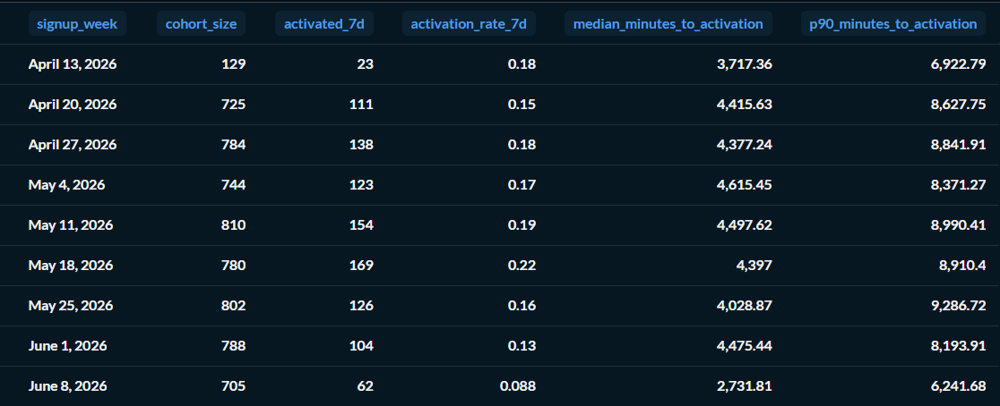

### E2 — Checkout Funnel

**Question:** Where is checkout leaking, and is the leak the same across paid social vs organic search?

**Key technique:** Each session is reduced to its **furthest observed funnel step**, preventing impossible funnel rates above 100%.

[`queries/ecom/e2_checkout_funnel.sql`](queries/ecom/e2_checkout_funnel.sql)

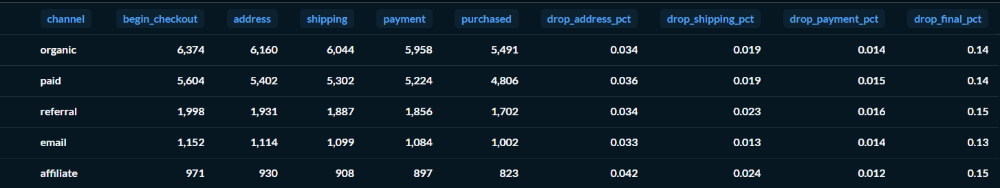

### E3 — Cohort Retention

**Question:** Of users who signed up in week W, what fraction came back and did something meaningful in W+1 through W+4?

**Key technique:** Signup-relative `week_index` rather than calendar-week joins, avoiding a classic cohort off-by-one error.

[`queries/ecom/e3_weekly_cohort_retention.sql`](queries/ecom/e3_weekly_cohort_retention.sql)

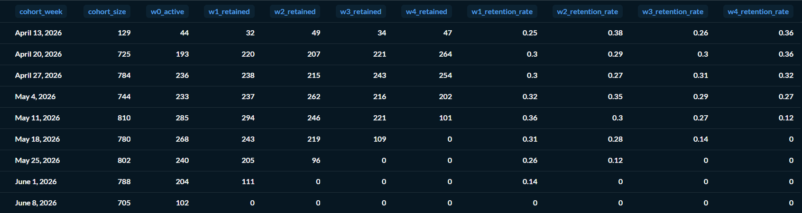

### E4 — PDP Engagement

**Question:** Which products attract eyeballs but fail to generate cart additions?

**Key technique:** Product ATC rate is benchmarked against the **category median**, not an arbitrary global threshold.

[`queries/ecom/e4_pdp_engagement.sql`](queries/ecom/e4_pdp_engagement.sql)

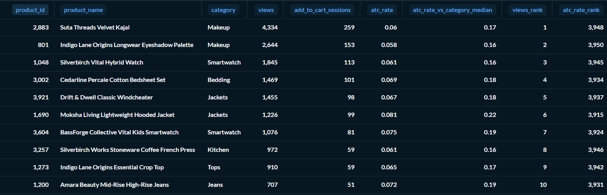

### E5 — Cart Abandonment

**Question:** Is abandonment equally painful at ₹500 and ₹15,000 cart values?

**Key technique:** Builds the cart at **session grain** first, then converts abandonment into estimated GMV leakage.

[`queries/ecom/e5_cart_abandonment.sql`](queries/ecom/e5_cart_abandonment.sql)

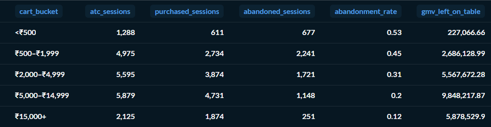

---

# ☁️ SaaS Product Analytics

### S1 — MRR Movement Decomposition

**Question:** How did MRR change, and what drove the change—new, expansion, contraction, churn or reactivation?

**Key technique:** Historical `subscription_events.mrr_delta` is classified into business buckets at account grain; current subscription state is not mixed into the movement calculation.

[`queries/saas/s1_mrr_movements.sql`](queries/saas/s1_mrr_movements.sql)

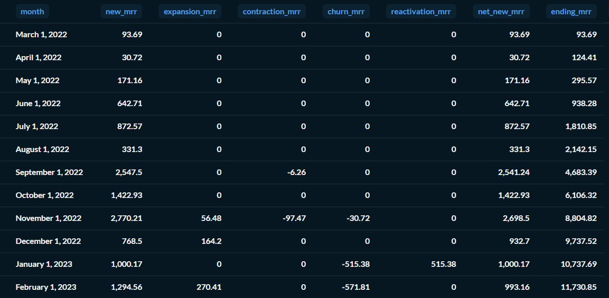

### S2 — Trial-to-Paid Conversion

**Question:** Of accounts that started a trial in week W, what fraction converted by day 14, 30 and 60?

**Key technique:** Trial population is separated from paid conversion events so a $0 trial is never mistaken for revenue.

[`queries/saas/s2_trial_to_paid.sql`](queries/saas/s2_trial_to_paid.sql)

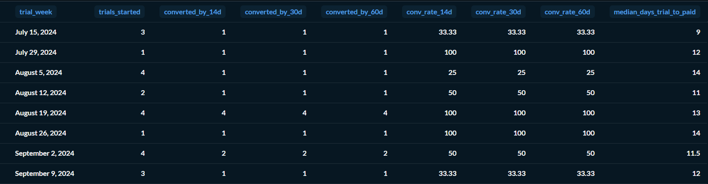

### S3 — GRR / NRR

**Question:** Of the MRR from a monthly cohort, how much remains after 12 months, with and without expansion?

**Key technique:** Revenue retention is analysed at account level, where **GRR cannot exceed 100%** but **NRR can** because expansion is included.

[`queries/saas/s3_grr_nrr.sql`](queries/saas/s3_grr_nrr.sql)

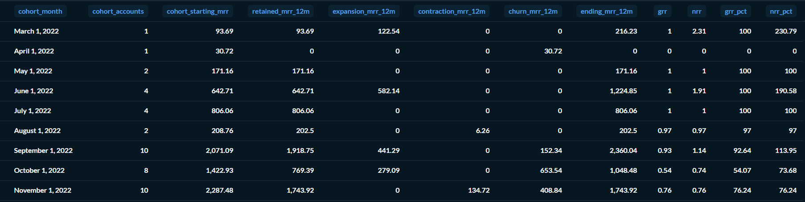

### S4 — Feature Adoption vs Retention

**Question:** Which product features are associated with stronger 90-day retention?

**Key technique:** Adoption is evaluated using the `feature_id` relationship and the analysis explicitly acknowledges selection bias.

[`queries/saas/s4_feature_adoption.sql`](queries/saas/s4_feature_adoption.sql)

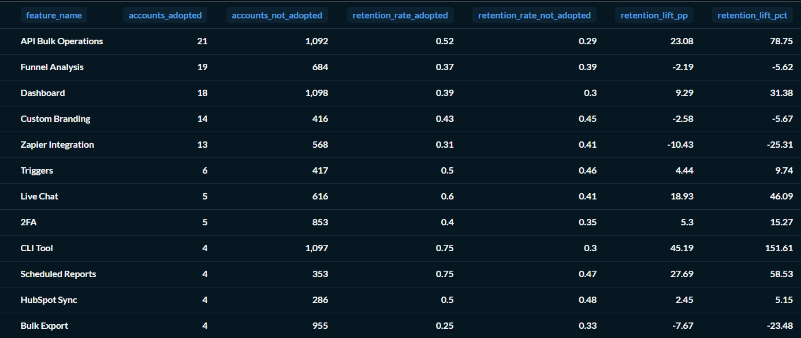

### S5 — Expansion Revenue

**Question:** Of accounts that expanded MRR, is the dominant motion seats, plan upgrades or add-ons?

**Key technique:** Directly classifies documented `subscription_events` vocabulary and reconciles expansion to S1.

[`queries/saas/s5_expansion_revenue.sql`](queries/saas/s5_expansion_revenue.sql)

---

# 🧭 Data Model

## 🛒 E-commerce relationship model

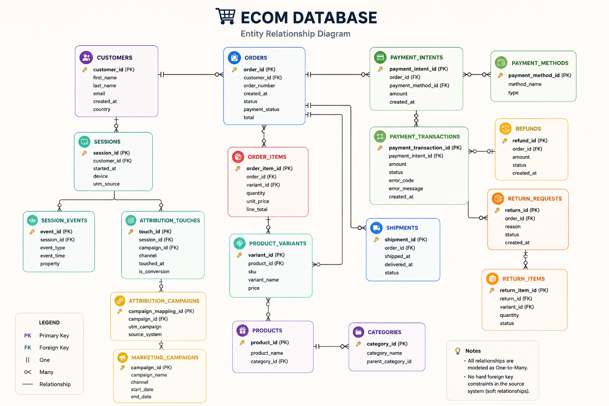

The E-commerce schema contains important soft relationships and therefore requires join validation rather than blind trust in naming conventions. The full working dictionary remains in [`notes/ecom_schema.md`](notes/ecom_schema.md).

## ☁️ SaaS relationship model

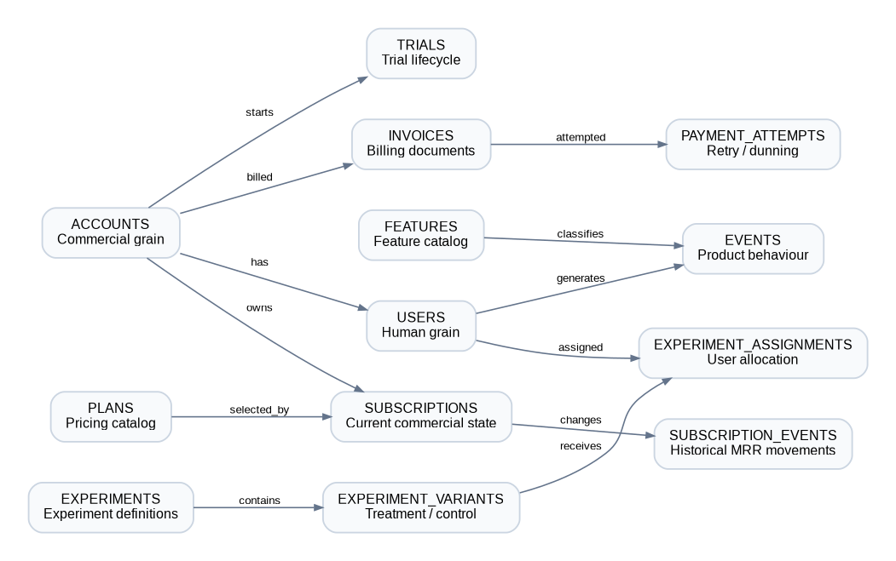

The SaaS model has two analytical layers:

```text
                ☁️ ACCOUNT ECONOMY
                       │
        ┌──────────────┼──────────────┐
        ↓              ↓              ↓
      users      subscriptions      trials
        │              │
        ↓              ↓
      events   subscription_events
        │
        ↓
     features
```

### 🚨 Most important SaaS grain rule

`subscriptions` has a split grain:

| `account_type` | Grain | `user_id` | Seat behaviour |
|---|---|---|---|
| `self_serve` | User-grain | Populated | Usually 1 |
| `b2b` | Account-grain | Generally NULL | Multiple seats possible |

For cross-segment commercial analysis, **`account_id` is the safest common grain**. This directly affects MRR, churn, retention, trial conversion and expansion analysis.

See [`notes/saas_schema.md`](notes/saas_schema.md) for the full onboarding dictionary, probe questions, relationship map and data-quality checks.

---

# 🖼️ Visual Evidence

### Recommended image set

| Filename | What to capture | Where it is used in the README | Why it matters |
|---|---|---|---|
| `ecom_er_diagram.png` | E-commerce schema diagram | Data Model | Shows schema fluency + relationship thinking |
| `saas_er_diagram.png` | SaaS schema diagram | Data Model | Shows account/user/subscription structure |
| `e1_activation_curve.png` | Metabase result for E1 | E1 section | Shows cohort activation rate and speed |
| `e2_checkout_funnel.png` | Metabase result for E2 | E2 section | Shows checkout funnel progression |
| `e3_weekly_retention.png` | Metabase result for E3 | E3 section | Shows relative-week behavioural retention |
| `e4_pdp_engagement.png` | Metabase result for E4 | E4 section | Shows high-view, below-median PDP performance |
| `e5_cart_abandonment.png` | Metabase result for E5 | E5 section | Shows abandonment rate vs GMV impact |
| `s1_mrr_movements.png` | Metabase result for S1 | S1 section | Demonstrates commercial/revenue analytics |
| `s2_trial_conversion.png` | Metabase result for S2 | S2 section | Shows trial-to-paid cohort conversion |
| `s3_grr_nrr.png` | Metabase result for S3 | S3 section | Shows B2B retention math |
| `s4_feature_adoption.png` | Metabase result for S4 | S4 section | Shows feature adoption vs retention |
| `s5_expansion_revenue.png` | Metabase result for S5 | S5 section | Shows revenue-growth diagnosis |


The exact image checklist and recommended capture order are documented in [`images/README.md`](images/README.md).

---

# ⚠️ Data Quality & Analytical Guardrails

| Risk | Handling |
|---|---|
| Mixed plan-name vocabulary | Normalize with `lower()` and explicit vocabulary mapping |
| NULL `plan_id` | Preserve rows with `left join` where appropriate; use text plan as fallback |
| Orphan `events.user_id` rows | Do not invent an account attribution; document/exclude from account-level attribution where necessary |
| Future-dated SaaS subscription events | Apply one consistent historical cutoff in MRR analysis |
| Split SaaS subscription grain | Use `account_id` as the common commercial entity |
| Incomplete latest cohorts | Treat recent E1/E3/S2 observation windows as censored, not zero |
| Funnel >100% risk | Use furthest-step logic before aggregation |
| Selection bias in feature adoption | Treat S4 as association, not causation |
| MRR double-counting | Use one canonical MRR source per analytical question |

---

# ✅ Validation Philosophy

Every analysis includes a sanity-check concept before it is treated as business-ready.

Examples:

- **E2:** `begin_checkout >= address >= shipping >= payment >= purchased`
- **E3:** `w0_active = cohort_size`
- **E4:** `add_to_cart_sessions <= views`
- **S1:** ending MRR reconciles to opening MRR + net movement
- **S3:** `grr <= 1.0`; NRR may exceed 100%
- **S5:** total expansion MRR reconciles to the S1 expansion bucket

The rule is simple:

> **A number that cannot survive an independent check is an insight draft, not a business insight.**

---

# 🛠️ Skills Demonstrated

### SQL
`select` · `join` · `case` · `filter` · `nullif` · `coalesce` · CTEs · window functions · `row_number()` · `lag()` · `lead()` · `percentile_cont()`

### Product Analytics
Activation · Conversion Funnels · Cohort Retention · Session Analytics · PDP Engagement · Cart Abandonment · Feature Adoption · Trial Conversion

### SaaS Analytics
MRR Movement · New/Expansion/Contraction/Churn/Reactivation · GRR · NRR · Expansion Revenue · Account-level analysis

### Analytics Engineering Habits
Grain-first modelling · defensive SQL · soft-FK validation · censoring awareness · reconciliation · selection-bias disclosure · readable naming

### Tools
PostgreSQL · Metabase · GitHub · Markdown · Notion

---

# 📁 Repository Structure

```text
sql-product-analytics/
├── README.md
├── INTERPRETATIONS.md
│
├── images/
│   ├── README.md
│   ├── ecom_er_diagram.png
│   ├── saas_er_diagram.png
│   ├── e2_checkout_funnel.png
│   ├── e3_weekly_retention.png
│   ├── s1_mrr_movements.png
│   ├── s3_grr_nrr.png
│   └── s5_expansion_revenue.png
│
├── notes/
│   ├── ecom_schema.md
│   └── saas_schema.md
│
└── queries/
    ├── ecom/
    │   ├── e1_activation_curve.sql
    │   ├── e2_checkout_funnel.sql
    │   ├── e3_weekly_cohort_retention.sql
    │   ├── e4_pdp_engagement.sql
    │   └── e5_cart_abandonment.sql
    │
    └── saas/
        ├── s1_mrr_movements.sql
        ├── s2_trial_to_paid.sql
        ├── s3_grr_nrr.sql
        ├── s4_feature_adoption.sql
        └── s5_expansion_revenue.sql
```

---

# 📖 Portfolio Case Study

> **B2C vs B2B: How Funnels and Retention Actually Differ** 

[🔗 Read the full case study](https://app.notion.com/p/Task-2-Product-Analytics-3d436a824e5b80f1906ecc900d01c503?source=copy_link)

---

<div align="center">

**Pranava Sharma K**  
Data Analytics · SQL · Product Analytics 

[LinkedIn](https://www.linkedin.com/in/pranava-sharma/)

</div>
