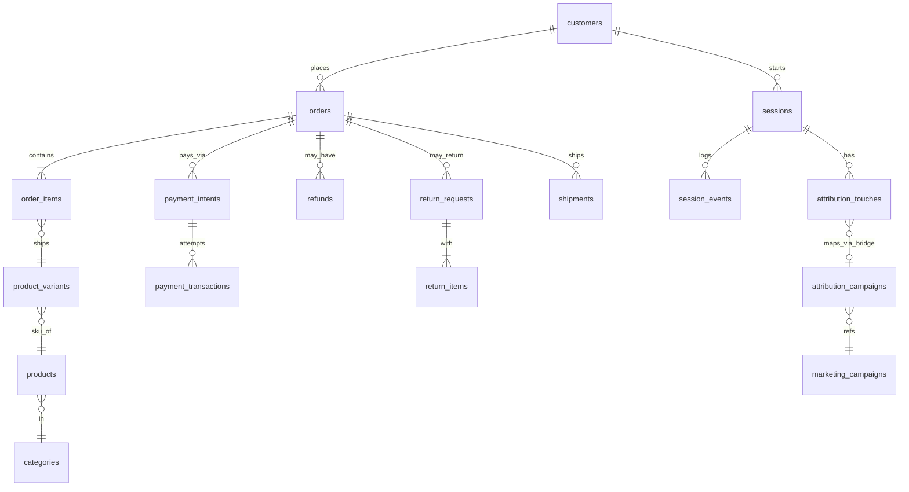

# `ecom` Schema Recon

Personal Day-1 schema dictionary for **Task 1 — SQL Foundation + Schema Recon**. The `ecom` warehouse has no declared foreign-key constraints, so relationships are treated as **soft joins** and validated with orphan checks before use.

## A. Table Inventory

| table | approx_rows | what it stores | grain |
| --- | ---: | --- | --- |
| `session_events` | 292,903 | instrumented behavioural event stream | one row per event |
| `order_status_history` | 158,414 | order status changes over time | one row per status change |
| `experiment_assignments` | 140,670 | A/B-test assignments | one row per assignment |
| `attribution_touches` | 100,000 | marketing touchpoints | one row per touch |
| `sessions` | 100,000 | website/app browsing sessions | one row per session |
| `devices` | 85,168 | browsing devices | one row per device |
| `order_items` | 81,806 | products/SKUs inside orders | one row per order line |
| `payment_transactions` | 40,034 | individual payment attempts/retries | one row per payment attempt |
| `orders` | 40,000 | customer orders | one row per order |
| `payment_intents` | 40,000 | logical intent to pay for an order | one row per payment intent |
| `attribution_campaigns` | 38,405 | touch-to-campaign bridge | one row per mapped touch/campaign |
| `shipments` | 32,089 | shipment/delivery records | one row per shipment |
| `inventory_movements` | 30,207 | stock changes | one row per movement |
| `prices` | 24,180 | variant pricing records | one row per price record |
| `loyalty_transactions` | 21,475 | loyalty points earned/spent | one row per loyalty transaction |
| `segment_memberships` | 16,461 | customer-to-segment bridge | one row per membership |
| `addresses` | 16,000 | physical addresses | one row per address |
| `customer_addresses` | 16,000 | customer-address bridge | one row per relationship |
| `product_variants` | 12,090 | sellable product variants/SKUs | one row per variant |
| `customers` | 10,000 | customer master | one row per customer |
| `product_reviews` | 8,000 | customer product reviews | one row per review |
| `product_images` | 7,188 | product image metadata | one row per image |
| `notifications` | 6,856 | email/SMS/push sends | one row per send |
| `products` | 4,000 | product catalog | one row per product |
| `loyalty_accounts` | 3,000 | loyalty memberships | one row per account |
| `return_items` | 2,004 | items inside return requests | one row per returned line item |
| `inventory_items` | 2,000 | warehouse/SKU stock records | one row per inventory record |
| `return_requests` | 1,603 | customer return requests | one row per return request |
| `refunds` | 260 | refunds issued | one row per refund |
| `brands` | 120 | product-brand lookup | one row per brand |
| `marketing_campaigns` | 100 | campaign definitions | one row per campaign |
| `coupons` | 50 | discount coupons | one row per coupon |
| `promotion_rules` | 30 | rules attached to promotions | one row per rule |
| `promotions` | 20 | promotional offers | one row per promotion |
| `categories` | 18 | product categories | one row per category |
| `experiment_variants` | 12 | A/B-test variant definitions | one row per variant |
| `customer_segments` | 10 | customer segment definitions | one row per segment |
| `return_reasons` | 8 | return-reason lookup | one row per reason |
| `experiments` | 6 | A/B-test definitions | one row per experiment |
| `payment_methods` | 5 | payment-method lookup | one row per method |
| `shipping_methods` | 3 | shipping-method lookup | one row per method |
| `shipping_carriers` | 3 | shipping-carrier lookup | one row per carrier |
| `price_lists` | 2 | pricing-list definitions | one row per price list |
| `collections` | 0 | unused/unfinished collections feature | no populated grain |
| `collection_products` | 0 | unused collection-product bridge | no populated grain |
| `consents` | 0 | unused consent feature | no populated grain |
| `session_channels` | view | first-touch channel per session | one row per session |
| `order_refunds` | view | refund total per order | one row per refunded order |

## B. Per-Column Notes

### `orders`

- **`order_id`** — unique order identifier; joins to `order_items.order_id`, `payment_intents.order_id`, refunds, returns and shipments.
- **`created_at`** — order timestamp (`timestamptz`); used for daily/monthly analysis.
- **`customer_id`** — soft relationship to `customers.customer_id`.
- **`session_id`** — session connected with the purchase; a known early-May instrumentation window contains more missing values than normal.
- **`payment_status`** — payment-conversion field: `paid` **37,822**, `failed` **2,178**. It is not the fulfilment status.
- **`status`** — fulfilment state. Observed values: `delivered` **19,779**, `shipped` **7,715**, `paid` **3,946**, `packed` **3,887**, `cancelled` **2,178**, `placed` **1,897**, `SHIPPED` **248**, `DELIVERED` **200**, `Shipped` **150**. Use `lower(status)` before grouping/filtering.
- **`subtotal`, `discount`, `tax`, `shipping_fee`, `total`** — order-level monetary fields; `total` is the headline order value used for order-level revenue/LTV.

### `order_items`

- **`order_id`** — soft relationship to `orders.order_id`.
- **`variant_id`** — joins to `product_variants.variant_id`.
- **`qty`** — quantity sold on the line.
- **`unit_price`** — per-unit selling price; Q4 reconciliation uses `qty * unit_price`.
- **`line_total`** — stored line revenue; Q5 uses it for paid-category revenue reconciliation.

### `customers`

- **`customer_id`** — customer identifier; parent of orders and identified sessions.
- **`created_at`** — signup timestamp; anchors Q2 cohort month.
- **`country`** — `India` **7,641**, `United States` **1,359**, plus **1,000** rows represented by blank/blank-like/`N/A` values. Normalize missing variants before grouping.
- **`acquisition_channel`** — `organic` **4,023**, `paid` **3,490**, `referral` **1,192**, `email` **708**, `affiliate` **587**.
- **`lifecycle_stage`** — canonical lifecycle classification; not required by Q1–Q10 and therefore not used as a portfolio headline metric.
- **`first_name`** — may contain whitespace/tabs/HTML-entity noise.
- **`dob`** — contains known sentinel values such as `1900-01-01` and `2099-12-31`; filter to a realistic range before age analysis.

### `sessions`

- **`session_id`** — unique session identifier.
- **`customer_id`** — populated for identified traffic; anonymous sessions are normal.
- **`started_at` / `ended_at`** — session bounds. Q3 starts on **2026-04-19**, when event instrumentation launched.

### `attribution_touches`

- **`touch_id`** — unique touch identifier; maps to `attribution_campaigns.touch_id`.
- **`session_id`** — soft relationship to `sessions.session_id`.
- **`channel`** — `organic` **39,924**, `paid` **34,905**, `referral` **12,146**, `email` **6,995**, `affiliate` **6,030**.
- **`touched_at`** — timestamp used for first-touch/last-touch ranking.
- **`utm_campaign`** — legacy campaign slug. Campaign-level work should bridge through `attribution_campaigns` because the campaign system migrated.

### `payment_intents`

- **`payment_intent_id`** — payment-intent identifier.
- **`order_id`** — soft relationship to `orders.order_id`.
- **`payment_method_id`** — joins to `payment_methods.payment_method_id`.
- **`status`** — `succeeded` **38,134**, `failed` **1,866**. Note that this vocabulary differs from `orders.payment_status` (`paid`/`failed`).

## C. Verified Relationships

The schema contains **0 declared foreign keys**. The following soft relationships were explicitly orphan-checked during recon:

| parent table | child table | join column | cardinality | orphan rows |
| --- | --- | --- | --- | ---: |
| `customers` | `orders` | `customer_id` | 1 → many | **0** |
| `orders` | `order_items` | `order_id` | 1 → many | **0** |
| `orders` | `payment_intents` | `order_id` | 1 → many | **0** |
| `sessions` | `attribution_touches` | `session_id` | 1 → many | **0** |

Additional join paths used in the ER diagram come from the Task-1 schema design and are treated as soft relationships. A relationship is not considered “verified” merely because the column names match; any future analysis using a new path should run the same orphan-check pattern first.

## D. ER Diagram

## E. Five Things That Surprised Me

1. **No formal foreign keys are declared.** Even obvious-looking relationships have to be validated rather than trusted from database constraints.
2. **`orders.status` has case drift.** `shipped`, `SHIPPED`, and `Shipped` coexist; a naïve equality filter can silently miss records.
3. **Payment outcome and fulfilment state are separate concepts.** `orders.payment_status` uses `paid`/`failed`, while fulfilment lives in `orders.status`; the two cannot be substituted.
4. **Event instrumentation starts mid-history on 2026-04-19.** Older sessions are uninstrumented, not zero-conversion sessions.
5. **The attribution stack spans two campaign systems.** Old `utm_campaign` slugs and new `CAMP-2026-*` IDs require the `attribution_campaigns` bridge for campaign-level analysis.

### Additional data-quality findings

- `customers.country` has multiple representations of missingness rather than one clean null value.
- `collections`, `collection_products`, and `consents` are genuinely empty (**0 rows**), so a zero-row result against them is a source-availability issue rather than necessarily a query bug.
- A short migration window around **2026-05-03/04** contains unusual `session_id`/tax completeness and should be treated as a documented instrumentation event.
