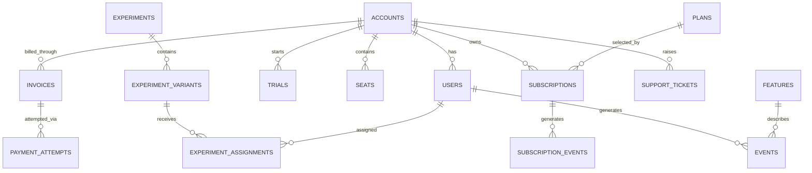

# SaaS Schema Dictionary

**Project:** Task 2 — Product Analytics SQL + SaaS Onboarding  
**Week:** 2  
**Day:** 1 — SaaS Schema Recon  
**Database:** PostgreSQL via Metabase  
**Schema:** `saas`  
**Deliverable:** `notes/saas_schema.md`

---

## 1. Objective

The purpose of Day 1 schema reconnaissance is to understand the SaaS data model before writing any product or revenue analytics queries.

The recon focuses on:

- table grain,
- account vs user relationships,
- subscription structure,
- MRR storage,
- trial and paid-state identification,
- timestamp handling,
- soft-delete behavior,
- important join paths,
- and known data-quality issues.

This document becomes the reference for the five SaaS analytics queries in Task 2.

---

# 2. Six Required Probe Questions

## 2.1 What is the grain of `subscriptions`?

The `subscriptions` table has a **split grain** depending on `account_type`.

### Self-serve accounts

For `self_serve` accounts:

- subscriptions are user-grain,
- `user_id` is populated,
- `seat_count = 1`.

### B2B accounts

For `b2b` accounts:

- subscriptions are account-grain,
- `user_id` is generally `NULL`,
- `seat_count` can contain multiple seats.

Therefore, SaaS queries cannot assume that every subscription belongs directly to a user. For cross-segment commercial analysis, `account_id` is the safer common grain.

### Verification query

```sql
SELECT
    a.account_type,
    COUNT(*) AS subscriptions,
    COUNT(*) FILTER (WHERE s.user_id IS NULL) AS null_user_id,
    COUNT(*) FILTER (WHERE s.user_id IS NOT NULL) AS populated_user_id,
    MIN(s.seat_count) AS min_seats,
    MAX(s.seat_count) AS max_seats
FROM saas.subscriptions s
JOIN saas.accounts a
    ON s.account_id = a.account_id
GROUP BY a.account_type
ORDER BY a.account_type;
```

**Observed result:**  
`[PASTE METABASE RESULT HERE]`

---

## 2.2 How is MRR stored and how should it be computed?

MRR means **Monthly Recurring Revenue**.

The SaaS schema contains two useful representations of MRR:

### Current state

`subscriptions.mrr`

This represents the MRR associated with the current subscription state.

### Historical movement

`subscription_events.mrr_delta`

This represents signed changes in MRR over time.

Examples:

- positive value → new MRR / expansion,
- negative value → contraction / churn.

For B2B subscriptions, MRR should reconcile approximately to:

```text
plans.monthly_price × subscriptions.seat_count
```

Self-serve subscriptions may contain prorated decimal values from the older billing system.

I will therefore use **one canonical MRR source per analytical question** and avoid combining subscription snapshots with event movements in a way that double-counts revenue.

### Verification query

```sql
SELECT
    s.subscription_id,
    s.account_id,
    s.plan_id,
    s.seat_count,
    p.monthly_price,
    s.mrr,
    p.monthly_price * s.seat_count AS expected_mrr,
    s.mrr - (p.monthly_price * s.seat_count) AS difference
FROM saas.subscriptions s
JOIN saas.accounts a
    ON s.account_id = a.account_id
LEFT JOIN saas.plans p
    ON s.plan_id = p.plan_id
WHERE a.account_type = 'b2b'
LIMIT 50;
```

**Observed result / conclusion:**  
`[PASTE RESULT OR SHORT CONCLUSION HERE]`

---

## 2.3 What `status` values exist on `subscriptions`?

### Verification query

```sql
SELECT
    LOWER(status) AS status,
    COUNT(*) AS subscriptions
FROM saas.subscriptions
GROUP BY LOWER(status)
ORDER BY subscriptions DESC;
```

### Observed values

| Status | Count |
|---|---:|
| `[STATUS]` | `[COUNT]` |
| `[STATUS]` | `[COUNT]` |
| `[STATUS]` | `[COUNT]` |
| `[STATUS]` | `[COUNT]` |
| `[STATUS]` | `[COUNT]` |

### Interpretation

Subscription status represents lifecycle state and must be separated from pricing-plan information.

Typical states may include trialing, active, past due, paused and cancelled, but only values returned by the database should be documented here.

---

## 2.4 How do I distinguish trial from paid?

Trials are represented in the dedicated `saas.trials` table and also appear in subscription lifecycle events.

A trial must not be treated as paid revenue simply because a subscription-related record exists.

B2B trial conversion may appear as:

```text
trial_converted
```

while self-serve paid starts may appear as:

```text
subscription_started
```

A trial normally has no paid MRR.

### Inspect trial columns

```sql
SELECT
    column_name,
    data_type,
    is_nullable
FROM information_schema.columns
WHERE table_schema = 'saas'
  AND table_name = 'trials'
ORDER BY ordinal_position;
```

### Inspect trial sample

```sql
SELECT *
FROM saas.trials
LIMIT 10;
```

### Inspect conversion-related subscription events

```sql
SELECT
    event_type,
    COUNT(*) AS event_count
FROM saas.subscription_events
WHERE event_type IN (
    'trial_started',
    'trial_converted',
    'subscription_started'
)
GROUP BY event_type
ORDER BY event_count DESC;
```

**Observed trial-to-paid mechanism:**  
`[WRITE YOUR VERIFIED CONCLUSION HERE]`

---

## 2.5 What timezone are timestamps in?

Timezone handling is important because Task 2 contains weekly cohorts, activation windows, trial-conversion windows, monthly MRR calculations and retention logic.

### Database timezone

```sql
SHOW timezone;
```

**Database timezone:**  
`[PASTE RESULT]`

### Timestamp-column types

```sql
SELECT
    table_name,
    column_name,
    data_type
FROM information_schema.columns
WHERE table_schema = 'saas'
  AND data_type LIKE 'timestamp%'
ORDER BY table_name, column_name;
```

**Conclusion:**  
`[WRITE WHETHER TIMESTAMPS ARE WITH/WITHOUT TIME ZONE AND HOW YOU WILL HANDLE THEM]`

---

## 2.6 Is there a soft-delete pattern?

A soft-delete pattern usually keeps a row in the database but marks it deleted through a field such as `deleted_at`.

### Verification query

```sql
SELECT
    table_name,
    column_name
FROM information_schema.columns
WHERE table_schema = 'saas'
  AND column_name = 'deleted_at'
ORDER BY table_name;
```

### Conclusion

`[WRITE WHICH TABLES HAVE deleted_at, OR STATE THAT NO SCHEMA-WIDE deleted_at PATTERN WAS FOUND]`

If soft-delete fields exist, analytical queries must intentionally decide whether to filter using `WHERE deleted_at IS NULL`.

---

# 3. SaaS Table Inventory

## Inventory query

```sql
SELECT
    table_name,
    column_name,
    data_type,
    is_nullable
FROM information_schema.columns
WHERE table_schema = 'saas'
ORDER BY table_name, ordinal_position;
```

## Approximate row-count query

```sql
SELECT
    relname AS table_name,
    n_live_tup AS approx_row_count
FROM pg_stat_user_tables
WHERE schemaname = 'saas'
ORDER BY n_live_tup DESC;
```

## Table dictionary

| Table | Approx. Rows | Grain | Purpose |
|---|---:|---|---|
| `accounts` | `[COUNT]` | One customer account | Paying/customer entity; distinguishes self-serve and B2B |
| `users` | `[COUNT]` | One human user | Users belonging to an account |
| `plans` | `[COUNT]` | One pricing plan | Pricing tiers and monthly prices |
| `subscriptions` | `[COUNT]` | Split user/account grain | Current subscription state, plan, seats and MRR |
| `subscription_events` | `[COUNT]` | One subscription movement | Historical subscription and MRR changes |
| `trials` | `[COUNT]` | One trial record | Trial lifecycle and conversion |
| `seats` | `[COUNT]` | One seat assignment | Seat assignments inside accounts |
| `invoices` | `[COUNT]` | One invoice | Billing records and invoice status |
| `payment_attempts` | `[COUNT]` | One charge attempt | Success/failure and retry/dunning behavior |
| `events` | `[COUNT]` | One product event | User product-usage telemetry |
| `features` | `[COUNT]` | One product feature | Feature catalog |
| `support_tickets` | `[COUNT]` | One support ticket | Support load, priority, category and CSAT |
| `email_sends` | `[COUNT]` | One email send | Lifecycle, re-engagement and dunning email activity |
| `experiments` | `[COUNT]` | One experiment | Product experiment definitions |
| `experiment_variants` | `[COUNT]` | One variant | Treatment/control definitions |
| `experiment_assignments` | `[COUNT]` | One assignment | User assignment to an experiment variant |
| `signups` | `[COUNT]` | One signup record/view row | Convenient signup and cohorting view |
| `legacy_*` | `[COUNT/NOTE]` | Legacy data | Historical reference only; excluded from current analysis |

---

# 4. Declared Relationships

## Foreign-key discovery query

```sql
SELECT
    tc.table_name,
    kcu.column_name,
    ccu.table_name AS foreign_table_name,
    ccu.column_name AS foreign_column_name
FROM information_schema.table_constraints tc
JOIN information_schema.key_column_usage kcu
    ON tc.constraint_name = kcu.constraint_name
JOIN information_schema.constraint_column_usage ccu
    ON ccu.constraint_name = tc.constraint_name
WHERE tc.constraint_type = 'FOREIGN KEY'
  AND tc.table_schema = 'saas';
```

**Observed FK result:**  
`[PASTE OR SUMMARIZE RESULT HERE]`

Important analytical join paths must still be validated with orphan tests even where relationships appear logically obvious.

---

# 5. Important Column Dictionaries

## 5.1 `accounts`

**Grain:** one customer/account.

| Column | Business meaning |
|---|---|
| `account_id` | Unique account identifier |
| `account_type` | Distinguishes `self_serve` from `b2b` |
| `[COLUMN]` | `[BUSINESS MEANING]` |

## 5.2 `users`

**Grain:** one human user.

| Column | Business meaning |
|---|---|
| `user_id` | Unique human-user identifier |
| `account_id` | Account to which the user belongs |
| `role` | Role such as owner/admin/member |
| `[COLUMN]` | `[BUSINESS MEANING]` |

## 5.3 `subscriptions`

**Grain:** split by account type.

| Column | Business meaning |
|---|---|
| `subscription_id` | Unique subscription identifier |
| `account_id` | Paying customer/account |
| `user_id` | Set for self-serve; generally NULL for account-level B2B subscriptions |
| `plan_id` | Link to `plans` when populated |
| `plan` | Text representation of plan; requires normalization |
| `seat_count` | Number of seats covered by subscription |
| `mrr` | Current monthly recurring revenue |
| `status` | Subscription lifecycle status |
| `started_at` | Subscription start |
| `cancelled_at` | Cancellation timestamp |
| `cancellation_reason` | Recorded reason for churn when available |

## 5.4 `subscription_events`

**Grain:** one subscription change/event.

| Column | Business meaning |
|---|---|
| `subscription_id` | Subscription affected |
| `user_id` | User for self-serve rows where applicable |
| `account_id` | Paying account; safest common commercial grain |
| `actor_user_id` | Human who triggered a B2B account change |
| `event_type` | Subscription lifecycle or MRR movement type |
| `event_time` | Timestamp of the movement |
| `from_plan` | Previous plan |
| `to_plan` | New plan |
| `mrr_delta` | Signed MRR change |
| `seats_delta` | Signed seat-count movement |

## 5.5 `plans`

**Grain:** one pricing plan.

| Column | Business meaning |
|---|---|
| `plan_id` | Plan identifier |
| `monthly_price` | Monthly price used in MRR logic |
| `[COLUMN]` | `[BUSINESS MEANING]` |

## 5.6 `events` + `features`

### `events`

**Grain:** one product-usage event.

Important concepts:

- `user_id` identifies the human producing the event,
- `feature_id` links feature-use behavior to the feature catalog,
- `occurred_at` records event time.

### `features`

**Grain:** one product feature.

`events.feature_id → features.feature_id` is the core adoption-analysis join path.

Older events may contain missing `feature_id` or inconsistent historical feature vocabulary. These should be documented rather than silently treated as clean data.

## 5.7 `payment_attempts`

**Grain:** one payment/charge attempt.

Important business concepts include payment status, failure reason, attempt number, invoice/subscription relationship, retries and dunning recovery.

---

# 6. Data Quality Findings

At least three verified findings are required. The following checks should be run and the **actual database result** documented.

## DQ1 — Plan-name case/vocabulary drift

```sql
SELECT
    plan,
    COUNT(*) AS subscriptions
FROM saas.subscriptions
GROUP BY plan
ORDER BY LOWER(plan), plan;
```

**Observed variants:** `[PASTE RESULT]`

**Risk:** Grouping by the raw `plan` field can split one commercial plan into multiple categories.

**Handling:**

```sql
CASE
    WHEN LOWER(plan) IN ('pro', 'professional') THEN 'pro'
    ELSE LOWER(plan)
END
```

## DQ2 — Orphan `user_id` rows in `events`

```sql
SELECT
    COUNT(*) AS orphan_event_rows
FROM saas.events e
LEFT JOIN saas.users u
    ON e.user_id = u.user_id
WHERE e.user_id IS NOT NULL
  AND u.user_id IS NULL;
```

**Orphan event rows:** `[COUNT]`

**Risk:** These events cannot reliably be mapped from user to account.

**Handling:** Exclude them from attributed account-level analysis or surface them separately as unattributed.

## DQ3 — NULL `plan_id` in subscriptions

```sql
SELECT
    COUNT(*) AS total_subscriptions,
    COUNT(*) FILTER (WHERE plan_id IS NULL) AS null_plan_id,
    ROUND(
        100.0
        * COUNT(*) FILTER (WHERE plan_id IS NULL)
        / NULLIF(COUNT(*), 0),
        2
    ) AS null_plan_id_pct
FROM saas.subscriptions;
```

- Total subscriptions: `[COUNT]`
- NULL `plan_id`: `[COUNT]`
- NULL rate: `[PERCENT]%`

**Risk:** An `INNER JOIN` from subscriptions to plans would silently remove these subscriptions.

**Handling:** Use a `LEFT JOIN` where appropriate and retain normalized `subscriptions.plan` as a fallback label.

## DQ4 — NULL `cancellation_reason`

```sql
SELECT
    COUNT(*) AS cancelled_subscriptions,
    COUNT(*) FILTER (WHERE cancellation_reason IS NULL) AS missing_cancellation_reason,
    ROUND(
        100.0
        * COUNT(*) FILTER (WHERE cancellation_reason IS NULL)
        / NULLIF(COUNT(*), 0),
        2
    ) AS missing_reason_pct
FROM saas.subscriptions
WHERE LOWER(status) = 'cancelled';
```

- Cancelled subscriptions: `[COUNT]`
- Missing reasons: `[COUNT]`
- Missing rate: `[PERCENT]%`

**Handling:** Retain these churn rows and classify the missing reason as `no_reason_given`.

## DQ5 — Future-dated `subscription_events`

```sql
SELECT
    COUNT(*) AS future_dated_events,
    MIN(event_time) AS first_future_event,
    MAX(event_time) AS last_future_event
FROM saas.subscription_events
WHERE event_time > DATE '2026-06-15';
```

- Future-dated rows: `[COUNT]`
- Earliest future event: `[TIMESTAMP]`
- Latest future event: `[TIMESTAMP]`

**Risk:** Future-dated legacy events can break historical MRR reconciliation.

**Handling:** Apply the documented cutoff consistently in S1, S3 and S5.

---

# 7. ER Diagram

> Final relationships should match the actual schema/FK inspection.



---

# 8. Three Required Relationship Queries

## 8.1 Active paying accounts right now

```sql
SELECT
    COUNT(DISTINCT s.account_id) AS active_paying_accounts
FROM saas.subscriptions s
WHERE LOWER(s.status) = 'active'
  AND COALESCE(s.mrr, 0) > 0;
```

**Result:** `[RUN RESULT]`

**Why `COUNT(DISTINCT account_id)`?** The business entity is an account, not a subscription row. Counting rows could overstate the number of paying customers.

## 8.2 Breakdown of accounts by normalized plan

```sql
SELECT
    CASE
        WHEN LOWER(s.plan) IN ('pro', 'professional') THEN 'pro'
        ELSE LOWER(s.plan)
    END AS normalized_plan,
    COUNT(DISTINCT s.account_id) AS accounts
FROM saas.subscriptions s
GROUP BY 1
ORDER BY accounts DESC;
```

| Normalized Plan | Accounts |
|---|---:|
| `[PLAN]` | `[COUNT]` |
| `[PLAN]` | `[COUNT]` |
| `[PLAN]` | `[COUNT]` |

## 8.3 Ten sample subscription events in chronological order

```sql
SELECT
    subscription_id,
    account_id,
    user_id,
    event_type,
    event_time,
    from_plan,
    to_plan,
    mrr_delta,
    seats_delta
FROM saas.subscription_events
ORDER BY event_time
LIMIT 10;
```

**Observation:** `[WRITE 1–3 SENTENCES ABOUT THE EVENT TYPES AND MOVEMENT FIELDS YOU OBSERVED]`

---

# 9. SaaS Analytical Join Map

```text
accounts
   |
   +---- users
   |       |
   |       +---- events ---- features
   |
   +---- subscriptions ---- plans
   |          |
   |          +---- subscription_events
   |
   +---- trials
   |
   +---- seats
   |
   +---- invoices ---- payment_attempts
   |
   +---- support_tickets
```

Important distinction:

```text
accounts
= commercial/customer entity

users
= humans inside the account

subscriptions
= current commercial state

subscription_events
= historical commercial movements

events
= product behavior
```

---

# 10. Analytical Rules Going Forward

1. Establish grain before every join.
2. Do not assume `user_id` is populated on every subscription.
3. Use `account_id` as the common commercial grain where self-serve and B2B must be compared.
4. Normalize plan vocabulary before grouping.
5. Do not silently discard subscriptions with NULL `plan_id`.
6. Do not discard churners because `cancellation_reason` is NULL.
7. Distinguish current MRR state from historical MRR movement.
8. Do not sum `subscriptions.mrr` and `subscription_events.mrr_delta` together without a valid reconciliation design.
9. Apply the future-event cutoff consistently in historical MRR queries.
10. Verify user-to-account attribution before product-adoption analysis.
11. Use `LEFT JOIN` intentionally where unmatched records should remain visible.
12. Validate important relationships with counts/orphan checks rather than assuming the schema is clean.

---

# 11. Key Learnings

The SaaS schema differs from the ecommerce schema because the central commercial entity is an **account**, while product usage still happens through individual users.

The most important schema finding is the split subscription grain:

- self-serve → user-grain,
- B2B → account-grain.

This makes grain selection critical before calculating MRR, churn, retention or conversion.

The second major distinction is between:

```text
subscriptions
→ current state

subscription_events
→ historical movements

events
→ product behavior
```

These differences determine which source should be used for each product or revenue metric later 
---